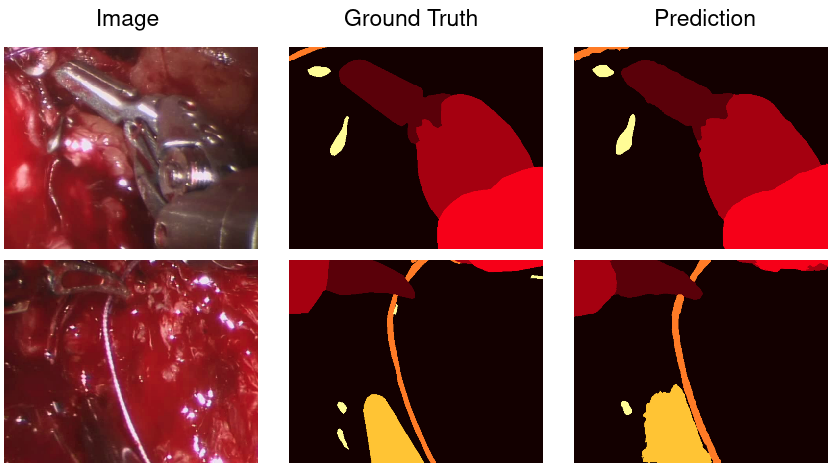
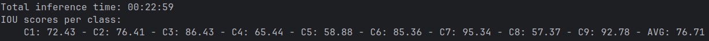

# Segmentation of Surgical Tools




## Description
A project developed for the segmentation task of the [MICCAI 2022 challenge SAR-RARP50](https://www.synapse.org/Synapse:syn27618412/wiki/616881)
[\[1\]](#ref-1). The task involves the segmentation 
of surgical tools from RGB frames of surgery videos. With this project we can easily 
train a deep learning-based segmentation model to tackle the segmentation task 
of the challenge, or potentially other similar segmentation tasks. 
Any model from 
[pytorch segmentation models](https://github.com/qubvel-org/segmentation_models.pytorch) 
can be chosen.


## Installation

- python version >= 3.11 is required

- To install and use this project you can follow these steps:
  1. Clone the repository
  2. Create your virtual environment
  3. Install the right [pytorch](https://pytorch.org/) version for your system smaller
  than 2.7. Tested with torch 2.5.1 and 2.6, with cuda 12.4 and 11.8, respectively.
  4. Run:

    ```bash
    pip install .
    # or for development
    pip install -e .
    ```


## Usage Instructions


### Get the dataset

If you want to experiment with this project on the MICCAI challenge, download the 
training dataset from:

https://rdr.ucl.ac.uk/articles/dataset/SAR-RARP50_train_set/24932529

and the test dataset from:

https://rdr.ucl.ac.uk/articles/dataset/SAR-RARP50_test_set/24932499

The training dataset is a zip folder (25.1 GB) that contains 45 videos, while the test 
dataset contains 10 videos (6.15 GB), all of them with annotations for 9 classes. The 
frame resolution is 1080$\times$1920.


### Create Training/Inference Dataset

The initial dataset should be a zip folder that contains either a folder for each sample,
or zip files, each one containing a folder for each sample. Every zip file/folder should 
contain a video as .avi file, and a folder called 'segmentation' with PNG images 
corresponding to all available segmentation masks of frames of the video. The names 
of the PNG masks should be the exact indexes of the corresponding video frames. 

Run the following command to convert the initial dataset to a dataset ready 
for training/inference:

```bash
stseg_create_dataset /zip_dataset_path /save_dataset_path n_classes patch_size
```

Example for the MICCAI segmentation task:

```bash
stseg_create_dataset /home/WildCapybara/projects/24932529.zip /home/WildCapybara/projects/datasets/STSeg 9 [512,640]
```
The above command will create a new dataset at 
/home/WildCapybara/projects/datasets/STSeg based on the initial dataset stored 
in /home/WildCapybara/projects/24932529.zip. The video frames and the 
corresponding segmentation masks for each case will be stored in a [.zarr file](https://zarr.readthedocs.io/en/stable/)
for efficient storage and retrieval, using chunking, with chunk size equal to 
the model’s input patch size. The dataset contains 9 classes, and we will use a chunk 
size of [512, 640]. The video frames will be normalized based on the encoder used for 
training.


### Training

Patches of the original images are fed to a segmentation model that predicts the
masks. On every batch, a percentage of the patches are randomly selected, and the 
rest are patches that contain a randomly selected class. The idea and implementation 
is based on [nnU-Net](https://github.com/MIC-DKFZ/nnUNet) [\[2\]](#ref-2), and in the 
project, the default percentage of patches having a random class is 33%. nnU-Net 
augmentations are also used on-the-fly while training such as, random flips, 
rotations, scaling, intensity augmentations, etc.

Below is the basic command to run training with the project:

```bash
stseg_train_model /dataset_path /results_path splitting n_classes patch_size --fold --progress_bar --continue_training
```

- */dataset_path* is the training dataset path.
- */results_path* is the path to store results.
- *splitting* indicates the mode of data splitting, and it can be either 
*'train-val-test'* or *'5fold'*. With 'train-val-test' splitting, the dataset will be
split into 70% training data, 10% validation and 20% test data. When you run training 
for the first time on a dataset, a .json file will be created in the dataset path,
containing the ids of the data sections.
- *n_classes* is the number of the classes in the dataset.
- *patch_size* is the training patch size.
- *fold* (optional) is the index of fold in 5fold training.
- *progress_bar* (optional) indicates whether we want to use tqdm progress bars.
- *continue_training* (optional) indicates whether we are continuing a training experiment.

The results folder will contain:

- A *config.yaml* file that contains all hyperparameters of the experiment
- A *loss_dict.pkl* to store loss values of every training epoch
- A *checkpoints* folder with the last training model and the best one
- A *plots* folder with images of random validation patches, their masks and 
predictions

Currently, the default configuration has a U-Net++ [\[3\]](#ref-3) architecture with 
MobileNetV3 encoder [\[4\]](#ref-4) pretrained on Imagenet. Everything in the 
configuration can be modified when running the training command by passing arguments
related to training. When continuing training it is not allowed to change anything in 
the configuration.

Training example for the MICCAI segmentation task:

```bash
stseg_train_model /home/WildCapybara/projects/datasets/STSeg /home/WildCapybara/projects/results/exp1 'train-val-test' 9 [512,640] -p --batch_size 12 --model_encoder_name mobilenet-v2
```

In the example we are using a 'train-val-test' splitting, 9 classes, [512, 640] input
size, -p to show progress bars, and we modify the default configuration by using a 
batch size of 12 and a mobilenet-v2 encoder.

You can continue training a model by passing -c in the training command.


### Inference

To run inference on a dataset use the following command:

```bash
stseg_infer /dataset_path /results_path
```

For inference, a sliding window approach is adopted, using the implementation from 
[MONAI](https://docs.monai.io/en/stable/inferers.html#sliding-window-inference-function).
The user can modify inference parameters in the configuration while 
running the inference command.

Obviously you should have already trained a model to run this command, and have a 
results folder created with this project. Every time you run the inference command,
a 'test_plots_i' folder will be created in your results folder, containing examples from
a random batch of each test sample. The configuration you used will also be stored in the
new folder, just in case you used different inference parameters than those stored when
you trained a model, or on other inference runs. When you run the command, you also get 
metrics printed per test case and averages (inference time, fps and IoU scores).

Example for the MICCAI segmentation task:

```bash
stseg_infer /home/WildCapybara/projects/datasets/STSeg_Test /home/WildCapybara/projects/results/exp1 --sw_batch_size 16
```

In the example we change the default batch size used in the sliding window step to 16.

If you trained a model with this project, and you used the 'train-val-test' splitting,
you can infer on the test partition by using as /dataset_path the path of the training
dataset.


## Full Example for MICCAI Challenge

With the default configuration (based on U-Net++ and MobileNetV3) and sliding window
overlap 0.75, by running the following commands we can achieve performance comparable 
to the challenge leaderboard:

```bash
# Create training dataset
stseg_create_dataset /home/WildCapybara/projects/24932529.zip /home/WildCapybara/projects/datasets/STSeg 9 [512,640]
# Train a model
stseg_train_model /home/WildCapybara/projects/datasets/STSeg /home/WildCapybara/projects/results/exp1 'train-val-test' 9 [512,640] -p
# Create test dataset
stseg_create_dataset /home/WildCapybara/projects/24932499.zip /home/WildCapybara/projects/datasets/STSeg_Test 9 [512,640]
# Run inference on the test dataset
stseg_infer /home/WildCapybara/projects/datasets/STSeg_Test /home/WildCapybara/projects/results/exp1 --sw_overlap 0.75 
```

This experiment was done on a laptop with an NVIDIA GeForce RTX 3060 Laptop GPU with 
6GB of memory and an 11th Gen Intel(R) Core(TM) i7-11800H CPU with 8 cores. Due to 
space limitations, not even the entire training dataset was used. 28 training examples
were used for training and 4 for validation. The original test set of 10 samples was used.

**Results on the test set**:



**Leaderboard**:


**Full resolution example**:


## How to Increase Performance

Certain choices can be made to increase performance, although most of them might come at 
the cost of inference speed. If enough resources are available, some promising options
might be:

1. Bigger patch size
2. Bigger model size
3. Pretrained Transformer-based model
4. Ensembles
5. Test time augmentation
6. Pretraining with similar datasets


## References

<a id="ref-1"></a> [1] Psychogyios, D., Colleoni, E., Van Amsterdam, B., Li, C.Y., 
Huang, S.Y., Li, Y., Jia, F., Zou, B., Wang, G., Liu, Y. and Boels, M., 2023. 
Sar-rarp50: Segmentation of surgical instrumentation and action recognition on 
robot-assisted radical prostatectomy challenge. arXiv preprint arXiv:2401.00496.
([link](https://arxiv.org/pdf/2401.00496))

<a id="ref-2"></a> [2] Isensee, F., Jaeger, P.F., Kohl, S.A., Petersen, J. and 
Maier-Hein, K.H., 2021. nnU-Net: a self-configuring method for deep learning-based 
biomedical image segmentation. Nature methods, 18(2), pp.203-211. ([link](https://www.nature.com/articles/s41592-020-01008-z))

<a id="ref-3"></a> [3] Zhou, Z., Rahman Siddiquee, M.M., Tajbakhsh, N. and Liang, J.,
2018, September. Unet++: A nested u-net architecture for medical image segmentation. 
In International workshop on deep learning in medical image analysis (pp. 3-11). 
Cham: Springer International Publishing. ([link](https://pmc.ncbi.nlm.nih.gov/articles/PMC7329239/pdf/nihms-1600717.pdf))

<a id="ref-4"></a> [4] Howard, A., Sandler, M., Chu, G., Chen, L.C., Chen, B., Tan, M., 
Wang, W., Zhu, Y., Pang, R., Vasudevan, V. and Le, Q.V., 2019. Searching for mobilenetv3.
In Proceedings of the IEEE/CVF international conference on computer vision 
(pp. 1314-1324). ([link](https://arxiv.org/abs/1905.02244))